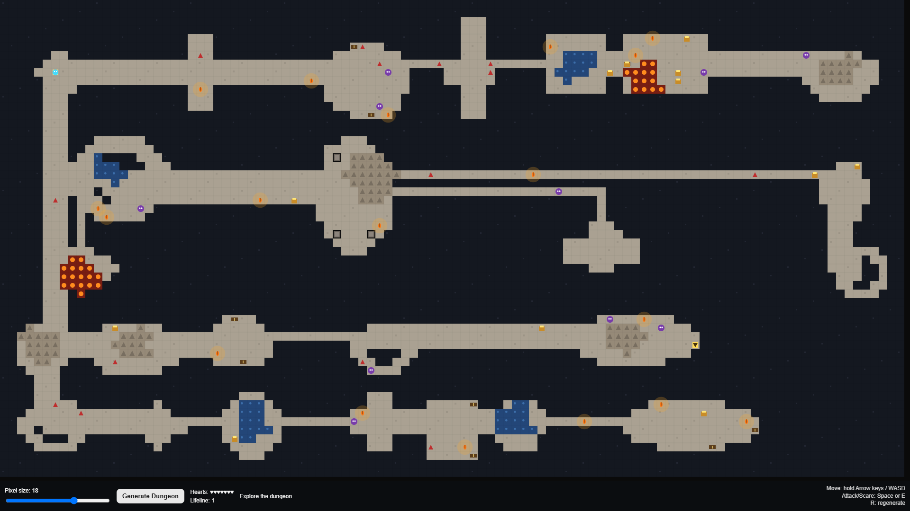

# Procedural Dungeon Generator

An interactive browser-based implementation of procedural dungeon generation built with p5.js.

Generates coherent, tile-based maps from compact local pattern references using a constraint‑inspired solver and score‑based local optimization. The UI supports painting/locking tiles, changing brushes and palettes, choosing reference patterns, seeding randomness, and exporting the generated map as an image.

## Result

## References
- Procedural Content Generation in Games: A Textbook and an Overview of Current Research - https://www.pcgbook.com/
- WaveFunctionCollapse - https://github.com/mxgmn/WaveFunctionCollapse
- Model Synthesis (Paul Merrell, SIGGRAPH 2007) - https://graphics.stanford.edu/~pmerrell/thesis.pdf
- Texturing & Modeling: A Procedural Approach (David S. Ebert et al.)
- Markov Random Field Modeling in Image Analysis (Stan Z. Li)
- Wang Tiles for Image and Texture Generation (Li-Yi Wei)
- Simulated Annealing (Kirkpatrick, Gelatt & Vecchi, Science 1983)
